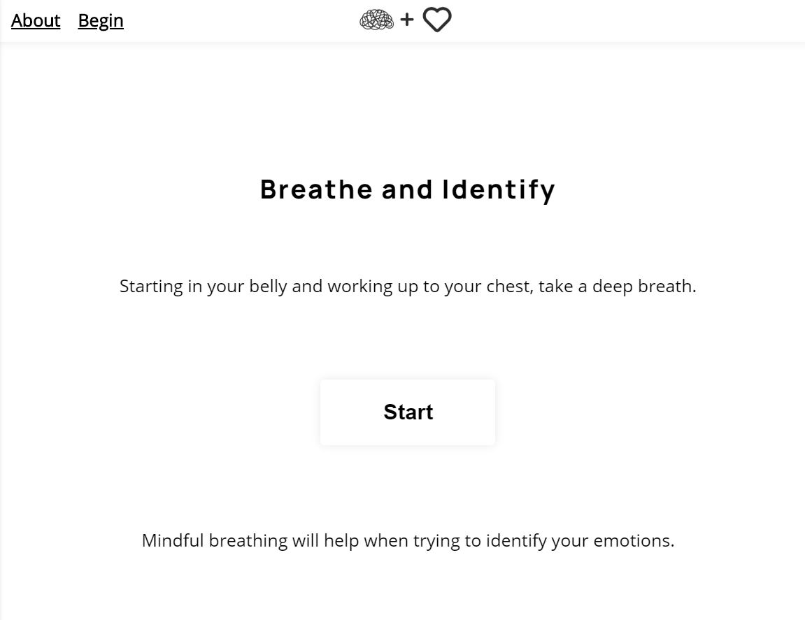
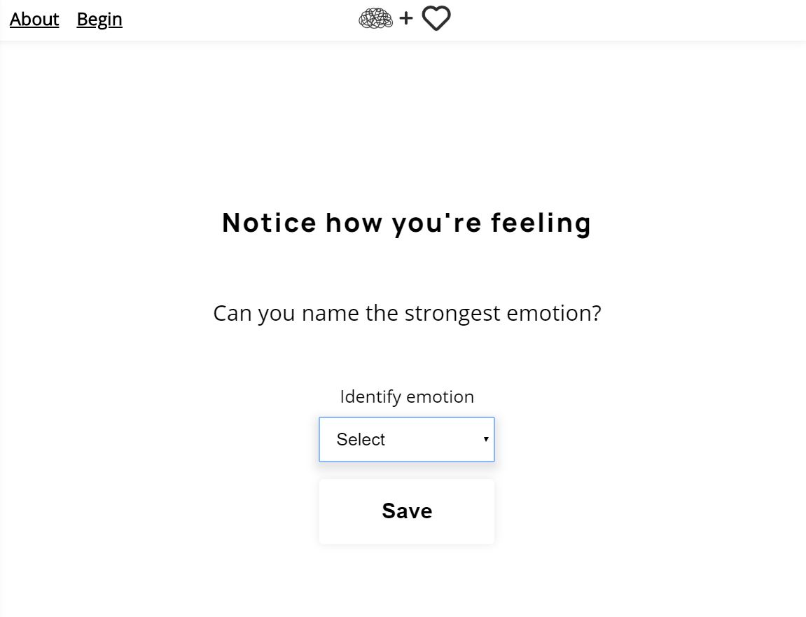
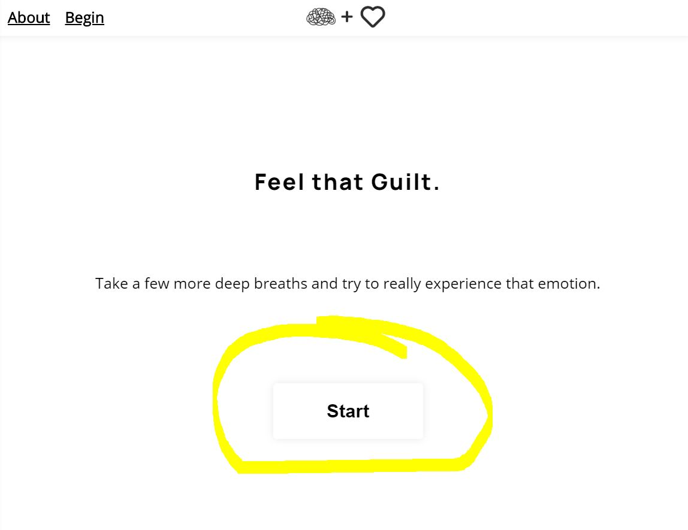
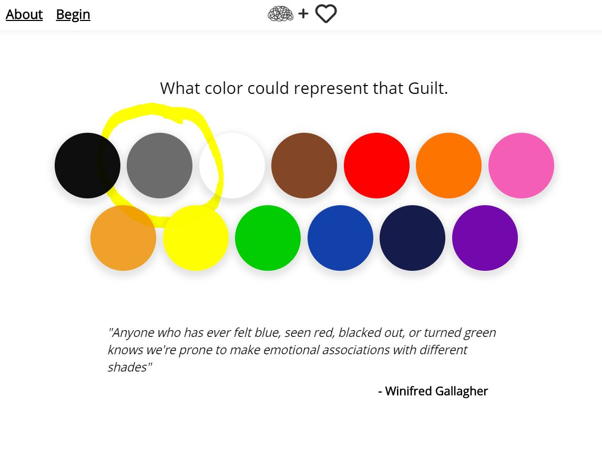
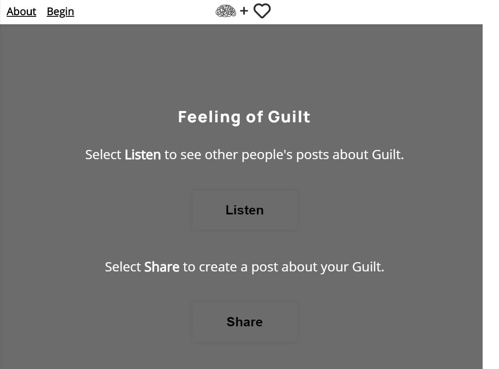
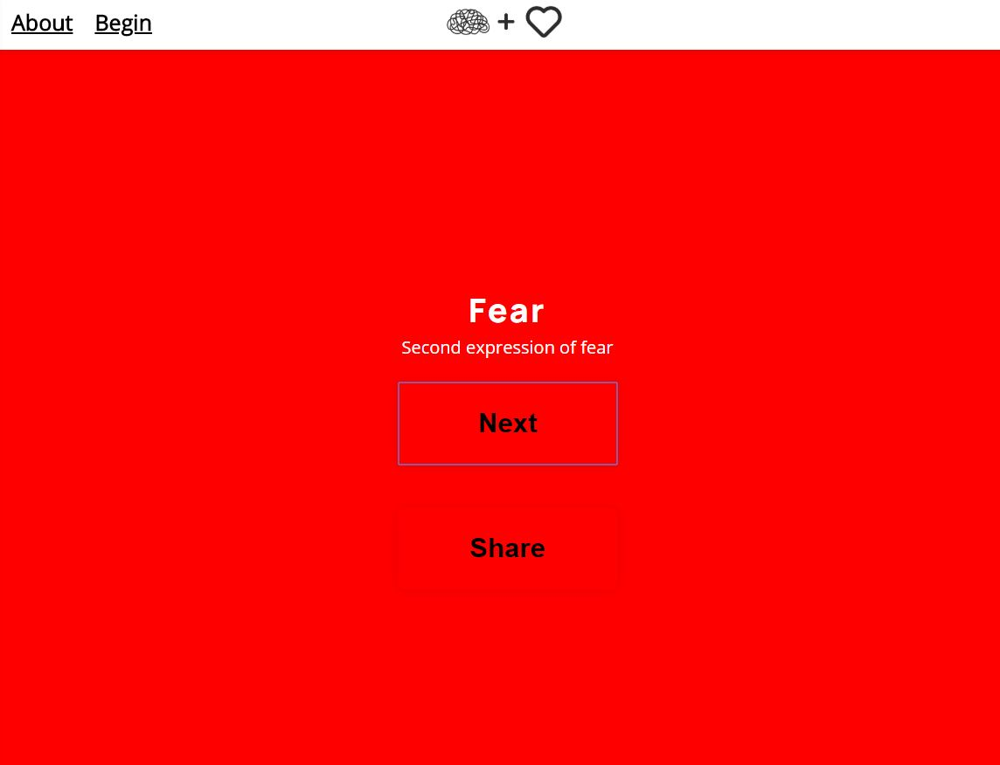
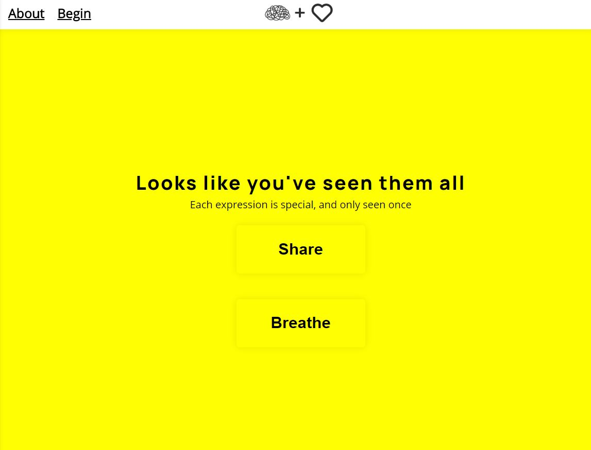
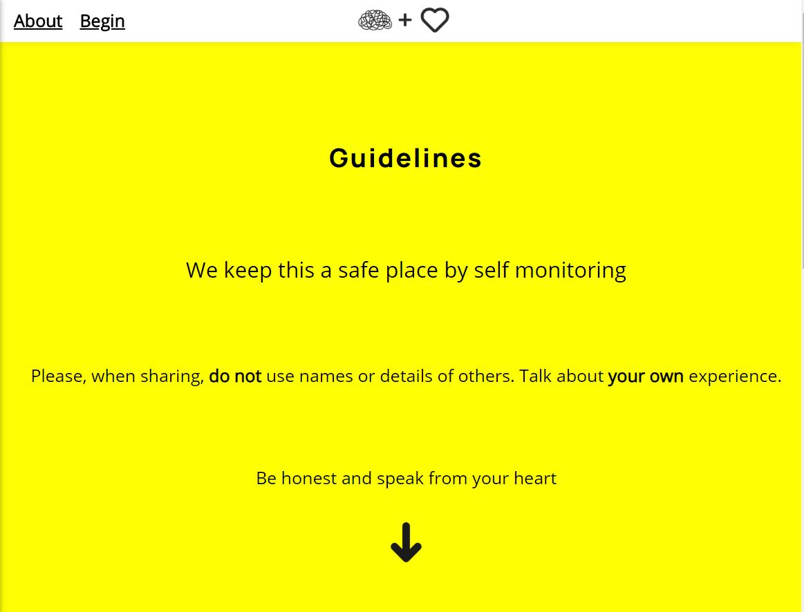
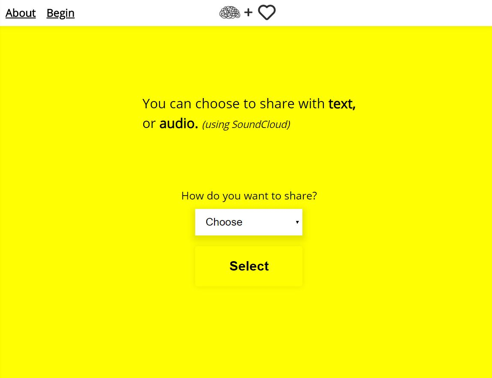
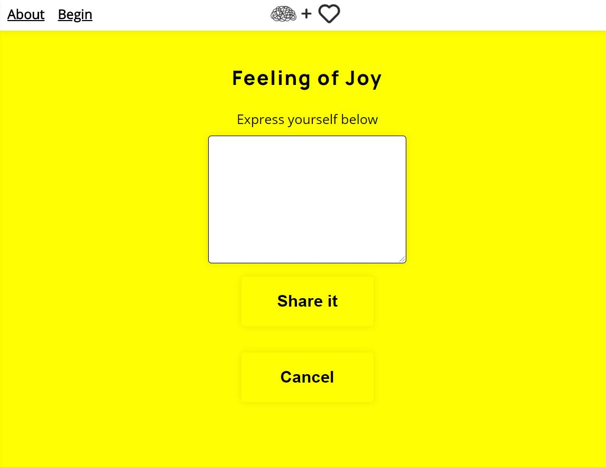

# Authentic

### A place to identify your emotions and express them in a healthy way

### Links

- Live App: [Click Here](https://beauthentic.app/)

- Live API: [Click Here](https://ifeelthat-api.herokuapp.com/)

- App Repo: [Click Here](https://github.com/mr-dojo/ifeelthat-app)

- API Repo: [Click Here](https://github.com/mr-dojo/ifeelthat-api)

## How to use it

### Begin by identifying an emotion you are feeling

1. #### from the landing page click "Begin"

2. #### go through the breath timer

3. #### select an emotion that you are feeling

4. #### go through the breath timer again

5. #### select a color that will represent that emotion

6. #### If you just want to listen to other people that are feeling the same emotion, click "Listen"
   #### If you want to express the emotion you are feeling, click "Share"

### Listen to/Read other people's experiences around the emotion you identified

1. #### Once you are done reading/listening and want to experience another, click "Next"

3. #### When you are ready to express yourself, click "Share"

### Share your experience around the emotion you identified with

1. #### Read the guidelines then choose how you want to share, "Text" or "Audio"

2. #### If you choose "Text", write about that feeling you are experiencing
   #### If you choose "Audio", follow the instructions on the screen

3. #### Click "Share" if you want to submit, click "Cancel" if you want to delete it

## Endpoints

- "/" landing page that describes the app, its purpuse, and how to use it
- "/breathe" take time to breath identify your emotions
- "/listen" listen and read other peoples experiences around the emotion you identified with
- "/share" share your experience around the emotion you identified with

## API endpoints

- "GET /feeling" returns a list of all feeling objects in the feeling table
- "POST /feeling" adds a new feeling object to the feeling table
- "GET /feeling/:id" returns a feeling object with the associated id from the feeling table
- "PATCH /feeling/:id" updates the feeling with the associated id from the feeling table
- "DELETE /feeling/:id" deletes the feeling with the associated id from the feeling table

- "GET /share" returns a list of all the share objects in the share table
- "POST /share" adds a new share object to the share table
- "GET /share/find?emotion=Anger&position=0" returns with all the share objects in the share table
  that match the "emotion" query param starting at the "position" array index along with its coorisponding color
- "GET /share/:id" returns the share with the associated id from the share table
- "PATCH /share/:id" updates the share with the associated id from the share table
- "DELETE /share/:id" deletes the share with the associated id from the share table

### Technologies used

This client side app is written in: HTML5, CSS3, Javascript ES6, and JSX.
I used React as a framework and Jest for testing.
The RESTful API was written in Javascript using Node.js with Express.
The database uses PostgreSQL.
